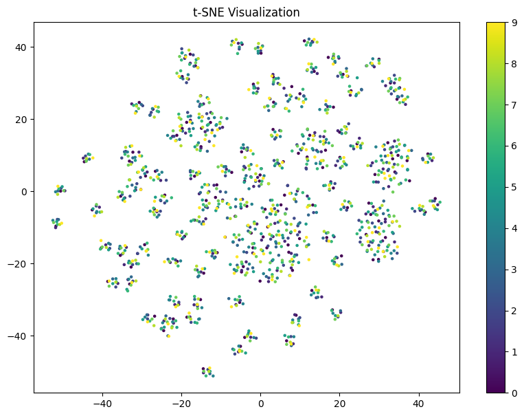

# Notes from meeting
- I accidentally created amortized SMI. This was surprising and not intentional.
- We spent an hour developing an architecture that uses a global variable m. This global variable was the only one to be affected by SMI. We then use a normalizing flow to go from m to z.
- The architecture is descriped in [Extra Documents/MI_VAE_outline.pdf](>../Extra%20Documents/SMI_VAE_outline.pdf)

## Normalizing flows

12:00
I spent some time learning about Normalizing flows and how to implement them in numpyro. I read chapter 3 in [Introduction to VAEs](https://arxiv.org/abs/1906.02691) about normalizing flows as Autoregressive neural networks such as Made. Luckily this is implemented in numpyro as AutoregressiveNN and InverseAutoregressiveTransform. I also found the BlockNeuralAutoregressiveNN which apparently only requires on pass through because it is more complex. I think i will use this since it is easier to implement. They are also similar to stax, which make it easy to import them via `numpyro.module`

14:00: I know realized that i cannot do this, because the BlockNN does not have an _inverse() function, which basically means i will nead to use the standard MADE autoregressive model.

16.30: I created an extension of the stax library for normalizing flow using the MADE autogressive model

## Problems
I cannot get the architecture to work for the MNIST dataset. It seems that i get exploding gradients or posterior collapse whatever i do. I have tried looking for bugs in the code. These are the following things i have tried:
- Adding permutations to the normalizing flow
- Adding inverse option
- Setting the numpyro.plate(subsample = batch_size) option, so that it scales correctly
- Looking through bugs.

### Kernel on means.
I could not figure out how to put the kernel on the means while mainting B parameters as stein particles. It seems like the library is built around taking all the stein particles and inputting them as a giant vector to the kernel function. My solution was to have shared variance vector B, but this might also be a source of problems. 

### MNIST
Its hard to iterate quickly on the dataset because of the large dimensions (784). Every run with the SMI engine takes more than a minute --which is not a lot-- but its hard to diagnose errors.
Maybe i should try to get the setup working on an even smaller dataset?

### Flow dimensions
The way i have done it with the MADE ARN means the m-dim has to be equal to the z-dim.

# Results from Amortized VAE
I dont feel it makes sense to write anything on the amortized VAE that i accidentally created last week. After running test, it seems that i meerely trained 10 identical encoders for the VAE. I checked the latent space of the generations using TSNE and here are the results:

This is the samples z in the latent space. Each color symbolizes a different particle-encoder. They all land almost exactly the same place and the error is probably just the sample variance.
Even though the parameters of the encoders are different, their output results have converged to the same.

